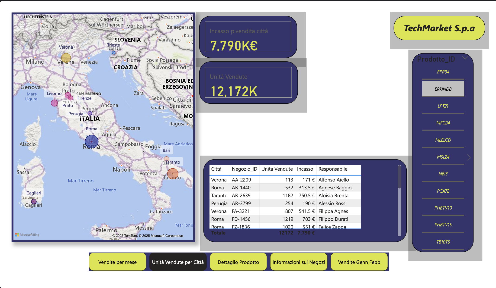

# 📊 Power BI Dashboard – TechMarket S.p.A.

## 🇮🇹 Italiano

Questo repository contiene una **dashboard interattiva** sviluppata con **Power BI** per l’azienda **TechMarket S.p.A.**.  
La dashboard analizza le performance di vendita, gli incassi e i resi, con un focus sui negozi distribuiti in varie città italiane.

---

### 📂 Contenuto
- `TechMarket_Spa.pdf` → Esportazione statica della dashboard in formato PDF
- `TechMarket_Spa.pbix` → File interattivo per powerBI

---

### 🚀 Funzionalità principali
La dashboard fornisce insight su:
- **Vendite per mese** (unità vendute e incassi mensili)  
- **Distribuzione geografica**: unità vendute per città e performance dei punti vendita  
- **Dettaglio negozio**: ID negozio, responsabile, incassi e unità vendute  
- **Analisi prodotto**: incassi, unità vendute e resi per singolo prodotto  
- **Analisi resi**: confronto tra unità vendute ed unità restituite  

---

### 📸 Anteprima

---

### 🔧 Tecnologie
- [Power BI Desktop](https://powerbi.microsoft.com/)  
- Dataset: **dati aziendali simulati di TechMarket S.p.A.**

---

### 📖 Utilizzo
1. Apri `TechMarket_Spa.pdf` per visualizzare la versione statica.  

---

### ✨ Autore
Progetto creato da **Gianmarco Martino**  
📧 Contatti: gianmymartino@gmail.com  
🌐 Portfolio: LinkedIn -  https://www.linkedin.com/in/gianmarco-martino-0323192a3/
              Github -  https://github.com/gianmyCta/

---

---

## 🇬🇧 English

This repository contains an **interactive dashboard** developed with **Power BI** for **TechMarket S.p.A.**.  
The dashboard analyzes sales performance, revenues, and returns, with a focus on retail stores located across Italian cities.

---

### 📂 Content
- `TechMarket_Spa.pdf` → Static export of the dashboard in PDF format
- `TechMarket_Spa.pbix` → Interactive Dashboard PowerBI

---

### 🚀 Key Insights
The dashboard provides analysis on:
- **Monthly sales** (units sold and revenues)  
- **Geographical distribution**: units sold by city and store performance  
- **Store details**: store ID, manager, revenues, and units sold  
- **Product analysis**: revenues, units sold, and returns by product  
- **Return analysis**: comparison between sold and returned units  

---

### 🔧 Technologies
- [Power BI Desktop](https://powerbi.microsoft.com/)  
- Dataset: **simulated company data from TechMarket S.p.A.**

---

### 📖 How to Use
1. Open `TechMarket_Spa.pdf` to view the static version.  

---

### ✨ Author
Created by **Gianmarco Martino**  
📧 Contact: gianmymartino@gmail.com
🌐 Portfolio: LinkedIn -  https://www.linkedin.com/in/gianmarco-martino-0323192a3/
              Github -  https://github.com/gianmyCta/
